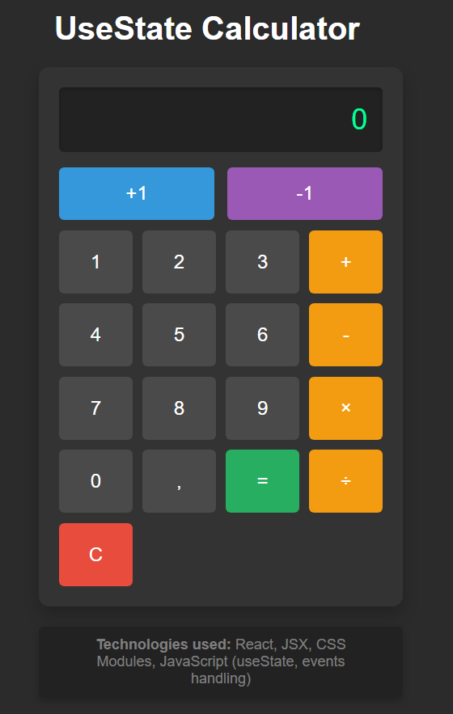

# React + Vite

//1 - Создайте состояние input, которое будет отображать результат вычислений в калькуляторе.

//2 - Создайте 2 функции для увеличения или уменьшения значения input на +1 или -1 и назначьте их на кнопки +1 / -1.

//3 - Создайте функцию, которая будет выполнять определенную операцию на калькуляторе в зависимости от нажатой кнопки. В результате работы этой функции должен получиться полностью рабочий калькулятор. Используйте эту функцию в обработчиках событий для всех кнопок.

